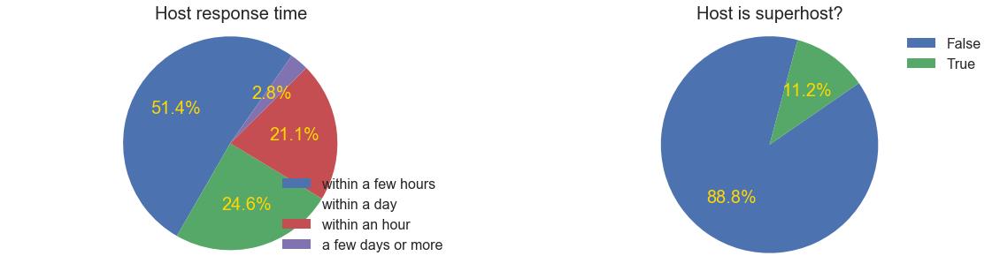
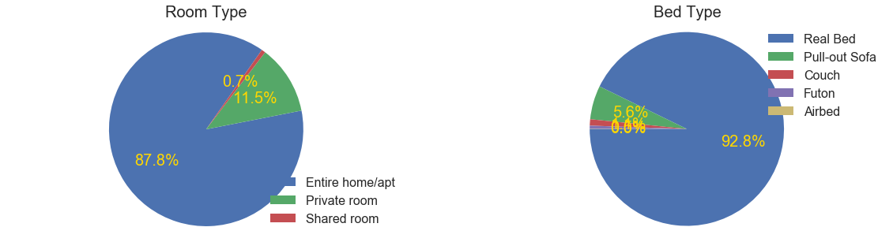
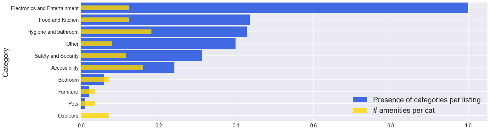
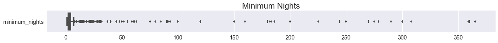
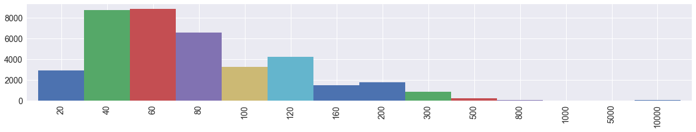
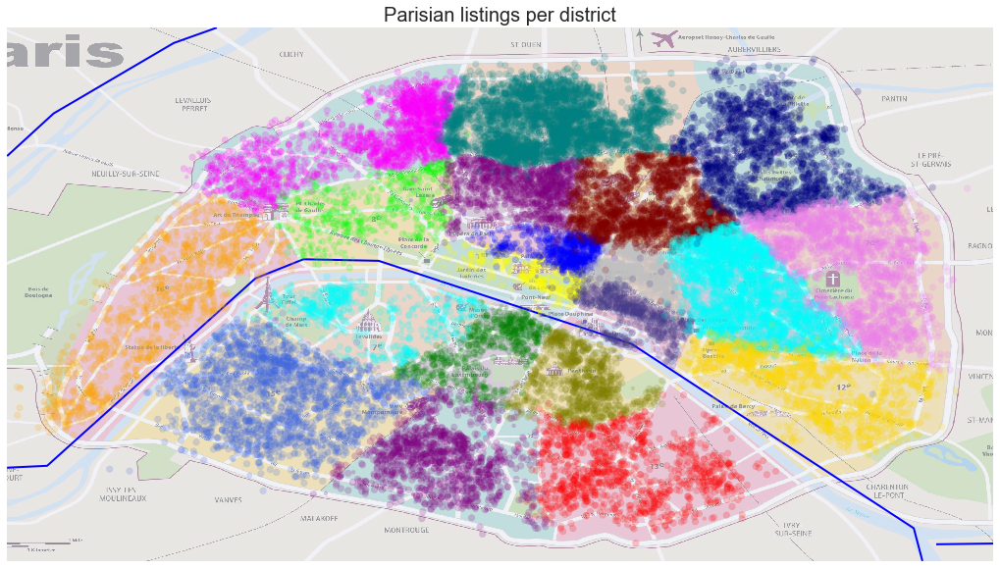
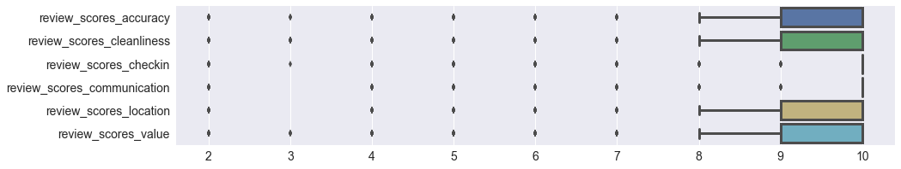
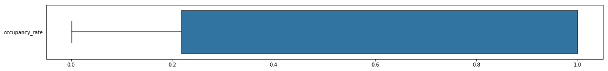
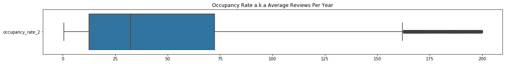

# MVP: Hosting per location or per property? 
---
# Introduction

Tourism is a major business in pretty much every country who has places and experiences to offer and that catch the interest of foreigners. Essential services for the tourists ranging from restaurants to hotels have flourished and in particular we've seen the company Airbnb enter in a peculiar manner. 

In the old days when hotels were sparse, tourists had no choice of its location so they resorted to choose establishments with other appealing features. Then came Airbnb and democratized the location giving tourists the option. 

I'd like to understand how tourists make choices involving hotel hunting and in order to have an accurate study a huge dataset is needed. A city with a myriad of listings has to be a city in the top ten places to visit and among them there are no best candidates than Paris in France. The tourist capital of the world, with a breaking record 40 million tourists per year, Paris is prepared to welcome them. 

---

# Background

Having lived in Paris for 4 years I became a francophiliac. To avoid forgetting the beautiful language they speak I keep up with the actualities in France and it was when I stumbled with this video that caught my attention (https://www.youtube.com/watch?v=Iywwa3wfhoU&t=35s). It's about Airbnb and its disruptive innovation that is affecting the residential housing in tourist-concentrated cities like Barcelona and Paris.

___
# *Are Airbnb guests more interested in listings that are in convenient neighbourhoods regardless of the condition of the property?*
---

# Questions and Goals

*To answer the above question, the **occupancy rate** of each listing needs to be calculated as it is the actual popularity rating and it's not provided by the dataset. Secondly this project will aim to answer the following questions:*

#### I. Where are the best listings? 
- What parameters define a popular listing? 

#### II. Which are Paris' convenient neighbourhoods to stay at?
- Define best/worst neighbourhoods with respect to the listing's price, proximity to transportation access, tourist attractions, parks and recreations. 
    - What is the proportion of high rated listings per district? 

---

# The Dataset

The data is taken from http://insideairbnb.com/get-the-data.html where the website offers popular city listings updated to this year. The data can be summarized in 6 categories: host, listing's summary, listing's specs, guest, location and reviews. 

Originally the dataset held 62848 listings described in 91 columns. These listings have been collected from 2009 to this year. 

The location information for listings are anonymized by Airbnb. In practice, this means the location (latitude and longitude) for a listing on the map, or in the data will be from 0-450 feet (150 metres) of the actual address.

Neighbourhood names for each listing are compiled by comparing the listing's geographic coordinates with a city's definition of neighbourhoods. Airbnb neighbourhood names are not used because of their inaccuracies.

---

# Initial Data Cleaning Approach and Exploratory Findings

From the 91 columns, I filtered out 30 columns containing paragraphs of descriptions and reviews and variables that were unnecessary (correlated) or irrelevant to the analysis. On the second filter, columns with a high volume of missing or incorrect values got removed leaving the dataset with 49 pertinent columns. I then grouped them in 5 categories: Host qualities, Listing specs, Location data and Review scores.  

The zipcodes and the cities were either inaccurate or mispelled. In order to clean them, I transformed the zipcodes into their numerical standard form. Then I grouped all the listings by zipcode and took the common city name to be the official name for the whole zipcode. 

## EDA: What are the factors that we can use to consider a good listing?

### *In host qualities:*

HOST_RESPONSE_TIME  

It's a categorical variable holding 4 unique values: 'within an hour', 'within a day', 'within a few hours','a few days or more' AND 11067 null values. 

A good host would be attentive to its guest's needs. The guest will evaluate the host's response time for every request made depending on its urgency to satisfy and/or difficulty to provide an accurate answer. The dataset shows that 21% have very reactive hosts who replied within the hour, 50% of hosts answered within a few hours and 24% within the day, the remaning 2.8% refer to hosts that for some reason delivered or not an answer outside of the usual delays. 

### *About the listing's specs:*

ROOM TYPE

It can be safe to assume that the best listings will offer entire homes or appartments at the guests disposition, in Paris 88% of the listings are full homes or appartments (the latter might be a more accurate guess), then 12% offer private rooms and only 0.7% shared rooms. 

BED TYPE

The best listings will have a real bed. That's a fact!

BEDS & BATHROOMS

If there are no bathrooms within the room or appartment, that can be inconvenient. 

The number of bathrooms range from 0 to 8 where 88% of the listings have 1 bathroom and 55% have 1 bed. On the other hand there are 33 listings that have no bathroom since they are not part of the common types of room. It turns out they are seminar rooms, showrooms, studios and "chambre de bonne" which are also studios located on the last floor and where the WC is outside somewhere along the corridor. 

There are 34 listings that dont list a bed at all. They must've forgot as they are all entire homes/apts with 0 real beds who can accommodate 2 to 7 guests and 1 to 4 extra people. So there is no such thing as a listing without beds, unless it's a seminary or showroom. Since I'm looking for factors that can affect the quality of the listing, the number of beds doesnt matter. 

On the other hand there are 7 Boutique hotel listings that report 50 bathrooms and 4 of them report 50 beds!    

AMENITIES
    
When it comes to amenities, listings will have the essential ones plus some extra that adds color and value to the listing. The **best listings** have at least the essential amenities and that's why Airbnb provides and option called "Essentials" and 94% listings did checked it. There are 136 unique amenities that I've simply categorized in 10 groups. 

The figure above shows the normalized presence of each category (of amenities) in the dataset (in blue) and the size of each category (in yellow). It can be interpreted that many listings have more of electronic amenities or entertainment related than amenities related to safety and security or accessibility. 

From the graph above one would intuitively say that as long as there are amenities refering to electronics and entertainment, the listing is showing promising. 

MINIMUM AND MAXIMUM NIGHTS

These are pieces of data that will help defining the occupancy rate. There appears to be 11 outliers in the minimum_nights with a values greater than 500. On the maximum nights side there are 22618 listings with values higher than 365. 

Cutting off the outliers the distribution of the minimum number of nights is of the form: 

With an average of 4.5 nights, I will use this as a standard value to get the occupancy rate. 

PRICE and LOCATION

The **best listing** should have a reasonable linear price/quality ratio. The less amenities a listing has (no real beds etc,) should yield a lower price and viceversa. Another intervening factor is the location. It is known that in most European cities the further you move away from the center the cheaper everything becomes. In Paris, this can be true except for certain districts like the 16th which is known to be quite expensive. In this project I will study this trinomial relationship. 

The price range resulted a bit sparse so I assigned them into broader intervals: 

The dataset shows 50 unique zipcodes and 50 unique cities (or districts) where Paris has approximately 20 zipcodes (or the number of its districts a.k.a arrondissements) and the remaining zipcodes greater than 75020 correspond to the suburbs. In the figure below are the listings in Paris only, where there are a few outliers quite far from the city limits. The size of each listing is proportional to its price

### *From the review section* 

NUMBER_OF_REVIEWS & REVIEWS_PER_MONTH

These descriptors will help in defining the **occupancy rate** which is the key factor of a good listing. The more reviews, the higher the occupancy rate, the higher the occupancy rate, the better the listing. 
    
Listings have 22 total reviews in average, this is considering old and new listings. A definite outlier has a bit over 600 reviews!! 
As for the reviews_per_month column there is listing #11034796 which is the only one having more than 50 reviews per month (224 to be exact) so without considering it the average reviews per month is 1. 

The dataset also provides a reviews csv file containing 1074759 reviews with its listing_id, date, reviewer_id and the review itself. I will use this table to confirm the accuracy of the two columns. 

REVIEW_SCORES..

Set of variables with scores for 6 different aspects of the listing: 

1. Rating: Variable with unknown origin, ranging from a score of 20 to 100 with a mean of 93
2. Accuracy: Refers to the accuracy of the description
3. Cleanliness: Speaks for itself. 
4. Checkin: Marks how smooth the host experienced its arrival and departure of the listing. 
5. Communication: Refers to the reactivity of the host in accurately fulfilling its host's requests. Should be correlated with host_response_time
6. Location: Refers to the quality of the neighbourhood. 
7. Value: Could be interpreted as the fairness in the price/listing ratio. 

---

# Initial Research Findings

### Getting the Occupancy rate:

Airbnb guests may leave a review after their stay, and these can be used as an indicator of airbnb activity (although not all guests leave a review, so the actual booking activity would be much higher). The occupancy rate according to Airbnb would be: 

>***Occupancy_rate = MAX(average_length_of_stay, minimum_nights)x(number_of_reviews)***

An average length of stay is configured for each city, and this, multiplied by the estimated bookings for each listing over a period gives the occupancy rate. For Paris, the average_length_of_stay is set to 3 nights/booking 

**Things to consider:**

- The listing's ancienty. A listing that just started in Airbnb is less likely to have as much reviews as an older listing. There's at least 7000 listings whose first review dates from this year! 

*To counteract the ancienty vs new listings bias, I will normalize the occupancy rate per month and assign its average rate as such. The dataset provides a column called reviews per month.*

- The availability.  A listing with a high availability is susceptible to get more reviews and thus increasing its occupancy rate. An Airbnb host can setup a calendar for their listing so that it is only available for a few days or weeks a year. Other listings are available all year round (except for when it is already booked). This poses a problem as the availability cannot be considered an accurate measure since it can either show the number of days the listing is supposed to be available but it can also show the remaining days a listing hasn't yet been booked thus lowering its availability.

***SCENARIO 1: ***The availability column means the number of days the listing is available per year, set by the host.

If the availability column is considered, then those listings with 0 days available will have to be removed or their value set to a non-zero one. There are 13045 listings that have no availability available, aside from that, the average availability is 145 days. 

Airbnb divides these listings in two categories: High availability for those listings with more than 120 days available and low availability for the rest. In this analysis I will not categorize the listings in these two broad groups but simply assign a weight proportional to its own availability. 

Then the occupancy rate has to be capped by:

> *** Average occupancy_rate per year <= min(1, (min_nights x booking_per_year)/days_available)***

.. since the term *(min_nights x booking_per_year)/days_available* can be higher than 1 and therefore not fair for listings with low availability. 

In this scenario the occupancy rate distribution is boxploted below: 

In this scenario the rate averages 0.752 and the median is 1. 

***SCENARIO 2*** The availability column refers to the days of the year that remain available and therefore there is no value in this variable as it doesnt describe the availability. The occupancy rate will be the one defined by Airbnb in the first case: 

> *Average occupancy_rate per year = min_nights x bookings per year = 12 x min_nights x reviews_per_month*

where basically says that the higher the average of bookings (reviews) per year, the higher the rate and thus the minimum nights can be removed as it is just a constant. The distribution yielded: 

___

# Further Research and Analysis

In order to get the most popular listings, the scenario #2 looks more promising as the occupancy rate shows a higher discriminatory power. The next steps are to determine the best listing according to the host qualities, listing specs, location (in terms of price and public transportation) and review scores. Thirdly I will insert the coordinates of the touristy places and get those listings that are closest and pull out the proportion of popular vs unpopular listings. 

There is room to implement association rules in variables such as amenities and host_verifications. As a host the re is interest in what sort of amenities are more apealing to guests. Which amenities can be considered luxurious and which are useless? 